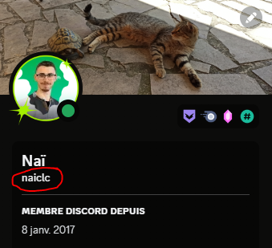

# BOT SW ESGI

Ce bot a été réalisé dans le cadre de l'association Summoners War de l'ESGI.
Son but est de s'occuper de l'inscription des membres, d'ouvrir les sessions et de consulter ses points.

## Prérequis
- NodeJS
- NPM
- Un serveur Discord (de préférence un serveur de test pour le développement)

## Installation
```
npm i
```

## Lancement du bot
```
node main
```

## Configuration
Le fichier de configuration se trouve dans la racine du projet et se nomme `config.js`.<br>
Il est possible de modifier les paramètres suivants:

#### Bot
- `token`: <br>
Le token du bot Discord, à récupérer sur le [portail développeur Discord](https://discord.com/developers/applications) et à insérer dans un fichier `.env` à la racine du projet.
- `api`: <br>
L'URL de l'API, ici créé par SheetDB [https://sheetdb.io/](https://sheetdb.io/) qui relie une Google Sheet à une API REST. Aussi à insérer dans le fichier `.env`.

#### Discord
- `devUsername`: <br>
Le nom d'utilisateur du développeur du bot, pour les droits sur les commandes manuelles.
- `subscribeChannel`: <br>
Le nom du channel où les membres peuvent s'inscrire.
- `botChannel`: <br>
Le nom du channel où on lance les commandes pour consulter ses points, lancer une session, etc.
- `memberRole`: <br>
Le nom du rôle attribué aux membres inscrits.

#### Session
- `maxTime`: <br>
Le temps maximum d'une session en minutes.
- `pointsSession`: <br>
Le nombre de points attribués par session.
- `guildName`: <br>
Le nom du serveur Discord.
- `sessionDay`: <br>
Le jour de la semaine où les sessions sont lancées.
- `sessionStartHour`: <br>
L'heure à laquelle les sessions sont lancées.
- `sessionEndHour`: <br>
L'heure à laquelle les sessions sont arrêtées.

## Commandes

### Start
Pour lancer une session manuellement:
```
!start
```

### Stop
Pour arrêter une session manuellement:
```
!stop
```

### Points
Pour consulter ses points:
```
!points
```